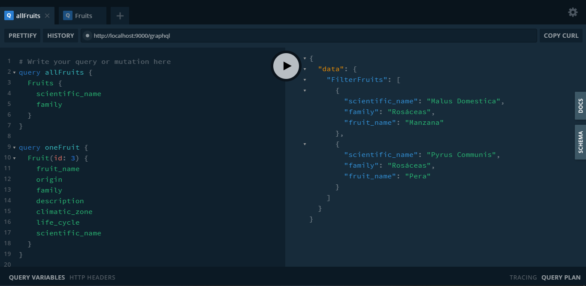

[](https://app.netlify.com/sites/fruits-api/deploys)

# Fruits API

API GraphQL con datos de árboles frutales.
Esta API esta construida con Apollo Server Lambda + Netlify Lambda.

> En este proyecto no estoy utilizando una base de datos.
> Los datos estan en [data.js](./src/data/data.js), por si deseas agregar más información. :)

### URL
[https://fruits-api.netlify.app/graphql](https://fruits-api.netlify.app/graphql)

### Obtener el codigo de este proyecto

1. Clonar repositorio:
```sh
$ git clone https://github.com/Franqsanz/fruits-api.git
```
2. Entrar al directorio del repositorio:
```sh
$ cd fruits-api
```
3. Instalar todas las dependecias:
```sh
$ npm install

# O con yarn
$ yarn
```
4. Una vez que instale todas las dependencias ejecute el siguiente comando:
```sh
$ npm start

$ yarn start
```

Una vez ejecutada la API, si todo sale bien debe ver en su terminal el siguiente mensaje: `Lambda server is listening on 9000`, abra su navegador y coloque en la URL `http://localhost:9000/graphql` y esto cargará el **GraphQL Playground**, debería ver lo siguiente:



Obviamente que el playground estará vacío usted deberá hacer las `querys`.

## Intruducción
Esta documentación lo ayudará a familiarizarse con los recursos de Fruits API y le mostrará cómo hacer diferentes consultas.

### Esquema de la API
| Key               | Type   | Description                       |
| ----------------- | ------ | --------------------------------- |
| id                | ID     | ID del árbol                      |
| scientific_name   | String | Nombre científico del árbol       |
| tree_name         | String | Nombre del árbol                  |
| fruit_name        | String | Nombre de la fruta                |
| family            | String | Tipo de familia del árbol         |
| origin            | String | Origen del árbol                  |
| description       | String | Breve descripción de árbol       |
| bloom             | String | Fecha de floración del árbol      |
| maturation_fruit  | String | Fecha de maduración del fruto     |
| life_cycle        | String | Ciclo de vida del árbol           |
| climatic_zone     | String | Zona climática del árbol          |

### Consigue todos los árboles
Puede acceder a la lista de los árboles con la siguiente `query`

query de ejemplo

```graphql
query allFruits {
  Fruits {
    id
    scientific_name
    fruit_name
    origin
    description
    climatic_zone
  }
}
```

Respuesta:
```json
{
  "data": {
    "Fruits": [
      {
        "id": "1",
        "scientific_name": "Malus Domestica",
        "fruit_name": "Manzana",
        "origin": "Asia Central",
        "description": "La manzana es el fruto del manzano, árbol de la familia de las rosáceas. Es una fruta pomácea de forma redonda y sabor más o menos dulce, dependiendo de la variedad. La manzana es un árbol caducifolio, generalmente de 2 a 4,5 m (6 a 15 pies) de altura en cultivo y hasta 9 m (30 pies) en la naturaleza.",
        "climatic_zone": "Frio"
      },
      {
        "id": "2",
        "scientific_name": "Pyrus Communis",
        "fruit_name": "Pera",
        "origin": "Europa Oriental y Asia Menor",
        "description": "La pera es el fruto del peral, árbol de la familia de las rosáceas. El fruto es un pomo comestible de verde marron. Es una especie de árbol caducifolio, generalmente de 2 hasta 20 m de altura.",
        "climatic_zone": "Templados, Húmedos y Frios"
      },

      // ...
    ]
  }
}
```

### Consigue un solo árbol
Puede obtener un solo árbol agregando el `id` como parametro: `(id: 5)`.

query de ejemplo

```graphql
query oneFruit {
  Fruit(id: 5) {
    id
    scientific_name
    tree_name
    fruit_name
    family
  }
}
```

Respuesta:
```json
{
  "data": {
    "Fruit": {
      "id": "5",
      "scientific_name": "Citrus x Tangerina",
      "tree_name": "Mandarino",
      "fruit_name": "Mandarina",
      "family": "Rutáceae"
    }
  }
}
```

### Filtrado de árboles
También puede filtrar los árboles por `family`, incluyendo el parametro `(family: String)`, por ejemplo `(family: "Rosáceas")`.

query de ejemplo

```graphql
query filterFruit {
 FilterFruits(family: "Rosáceas") {
    id
    tree_name
    fruit_name
    family
  }
}
```

Respuesta:
```json
{
  "data": {
    "FilterFruits": [
      {
        "id": "1",
        "tree_name": "Manzano",
        "fruit_name": "Manzana",
        "family": "Rosáceas"
      },
      {
        "id": "2",
        "tree_name": "Peral",
        "fruit_name": "Pera",
        "family": "Rosáceas"
      }
    ]
  }
}
```

---
Hecho con ❤ por [Franqsanz](https://franqsanz.netlify.app/)